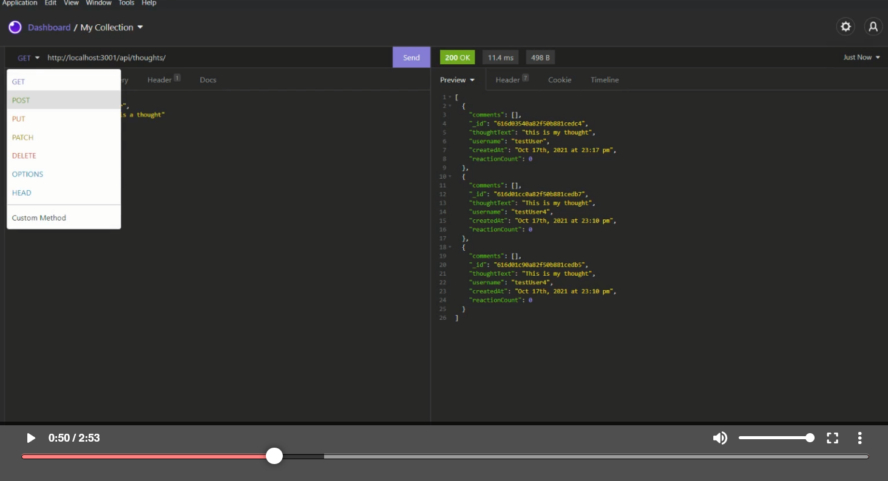

# social-network-api

[Demo Video](https://watch.screencastify.com/v/HlqY1jxJyJ7RHkQZXMv7)

## Description

Welcome to my backend social networking app. Here I honed my skills as a fullstack developer by practicing my backend skills. This app was made with Express, NoSQL (MongoDB) and Mongoose.

## Table of Contents

- [Installation](#installation)
- [Usage](#usage)
- [Credits](#credits)
- [License](#license)
- [Author](#author)
- [Badges](#badges)

## Installation

To install this project simply download it's source code and install it's need packages: Mongoose and Express.

## Usage

To use this app you will need Insomnia.

## Credits

Credits

## License

MIT License

Copyright (c) [2021] [David Whipple]

Permission is hereby granted, free of charge, to any person obtaining a copy
of this software and associated documentation files (the "Software"), to deal
in the Software without restriction, including without limitation the rights
to use, copy, modify, merge, publish, distribute, sublicense, and/or sell
copies of the Software, and to permit persons to whom the Software is
furnished to do so, subject to the following conditions:

The above copyright notice and this permission notice shall be included in all
copies or substantial portions of the Software.

THE SOFTWARE IS PROVIDED "AS IS", WITHOUT WARRANTY OF ANY KIND, EXPRESS OR
IMPLIED, INCLUDING BUT NOT LIMITED TO THE WARRANTIES OF MERCHANTABILITY,
FITNESS FOR A PARTICULAR PURPOSE AND NONINFRINGEMENT. IN NO EVENT SHALL THE
AUTHORS OR COPYRIGHT HOLDERS BE LIABLE FOR ANY CLAIM, DAMAGES OR OTHER
LIABILITY, WHETHER IN AN ACTION OF CONTRACT, TORT OR OTHERWISE, ARISING FROM,
OUT OF OR IN CONNECTION WITH THE SOFTWARE OR THE USE OR OTHER DEALINGS IN THE
SOFTWARE.

## Author

You can view more of my work at [my github](https://github.com/D-Whipp)

## Badges

